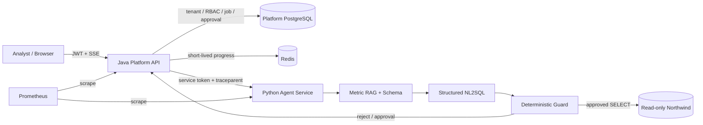
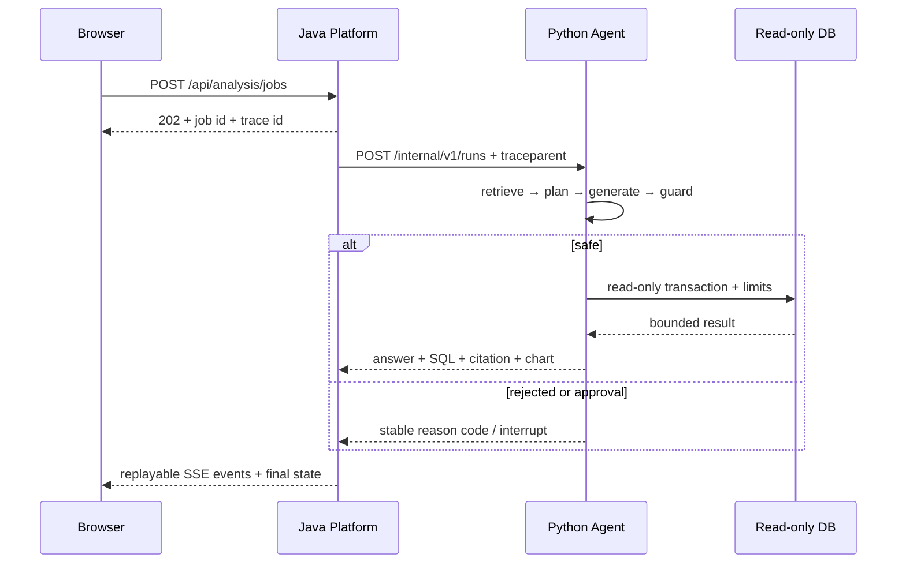

# Enterprise Data Copilot

## 30 秒介绍

面向零售经营分析的、可控且可审计的企业数据与指标知识分析 Agent。

业务分析员可以用自然语言查询 Northwind 零售数据。系统结合数据库元数据与指标定义生成只读 SQL，在执行前完成确定性安全检查，并返回可追溯的文字结论、表格、图表规范、SQL 与引用。它不是一个可以任意操作数据库的通用 Agent。

> 当前状态：P0～P12 的仓库内范围已完成本地验收。系统具备安全 NL2SQL、可引用的混合检索、持久化 LangGraph 审批、异步 SSE、完整 Web UI、可重复评测、W3C trace、OpenTelemetry 节点 span、Prometheus 指标、全栈 Compose 和作品集证据。公网部署、真实模型批量评测和真人录屏属于显式发布动作，未伪装为已完成。

## 核心演示

1. 分析员询问“2025 年每季度销售额和环比变化是多少？”
2. 系统展示规划、指标检索、SQL 生成、安全检查、执行和分析步骤。
3. 结果包含口径引用、只读 SQL、数据表与结构化图表规范。
4. 对“删除所有订单”等危险请求，在 SQL 执行前明确拒绝并留下审计记录。

## 架构与请求时序





详细职责和信任边界见 [总体架构](docs/architecture.md) 与 [ADR-0001](docs/adr/0001-java-python-boundary.md)。

## 安全边界

- 主场景：零售经营分析。
- 主评测数据集：Northwind；Chinook 仅用于迁移验证。
- 数据访问：只读 PostgreSQL；不支持写入客户数据库。
- 服务职责：Java 负责身份、租户、权限、任务、审批和审计；Python 负责检索、规划、NL2SQL、安全校验与结果解释。
- 模型权限：模型不能绕过 SQL AST 规则、数据库只读账号、查询超时和结果上限。
- 浏览器只访问 Java；Python 内部 API 要求服务令牌和可信身份头。
- 演示部署的数据源主机受 allowlist 限制，响应不返回 host、DSN 或 `secret_ref`。
- 图表只接受固定结构化规范，不执行模型生成的 JavaScript、Python、HTML 或 shell。
- trace/span/指标和步骤日志只记录 allowlist 元数据、稳定错误码与 SQL 指纹，不记录密钥、问题全文、SQL 参数或业务结果。

## 项目文档

- [第一阶段小结：P0～P2](docs/milestone-1-foundation-summary.md)
- [产品需求](docs/product-requirements.md)
- [总体架构](docs/architecture.md)
- [Java/Python 服务边界 ADR](docs/adr/0001-java-python-boundary.md)
- [手工验收问题与拒绝场景](docs/manual-acceptance.md)
- [实施计划审视](docs/implementation-roadmap.md)
- [阶段一实施与验证记录](docs/stage-1-foundation.md)
- [阶段二数据与元数据验收记录](docs/stage-2-data-metadata.md)
- [阶段三 Java 业务平台验收记录](docs/stage-3-java-platform.md)
- [阶段四模型适配与结构化输出验收记录](docs/stage-4-llm-provider.md)
- [固定 SQL 安全纵向切片验收记录](docs/stage-safety-vertical-slice.md)
- [阶段五安全 NL2SQL 验收记录](docs/stage-5-safe-nl2sql.md)
- [阶段六指标知识库 RAG 验收记录](docs/stage-6-metric-rag.md)
- [阶段七 LangGraph 与人工审批验收记录](docs/stage-7-agent-approval.md)
- [阶段八异步执行与 SSE 验收记录](docs/stage-8-async-sse.md)
- [阶段九前端验收记录](docs/stage-9-web.md)
- [阶段十完整评测验收记录](docs/stage-10-evaluation.md)
- [阶段十一可观测性、性能与部署](docs/stage-11-observability-deployment.md)
- [阶段十二作品集交接](docs/stage-12-portfolio-handoff.md)
- [5～7 分钟演示脚本](docs/demo-script.md)
- [简历证据与可追溯表述](docs/resume-evidence.md)
- [当前本地启动手册](docs/current-local-startup-guide.md)
- [两次本地运行故障的定位与解决记录](docs/runtime-incident-resolution.md)

## 计划技术栈

- Web：React / Next.js + TypeScript
- Platform API：Java 21 + Spring Boot + Spring Security + Flyway
- Agent Service：Python 3.12 + FastAPI + LangGraph + Pydantic + SQLGlot
- 数据：PostgreSQL + pgvector、独立只读业务 PostgreSQL、Redis
- 验证：JUnit、pytest、Testcontainers、Playwright、NL2SQL/RAG 评测集

## 当前里程碑

| 阶段 | 状态 | 退出条件 |
|---|---|---|
| P0：题目和证据 | 已完成初版 | 场景、边界、架构决策和验收样例可评审 |
| P1：本地环境和骨架 | 已完成本地验收 | 三个服务健康检查、依赖可一键启动、本地 CI 等价命令通过 |
| P2：固定数据、元数据与只读边界 | 已完成（本地） | 真实 PostgreSQL 的 5 项集成测试通过 |
| P3：Java 身份、租户与任务平台 | 已完成（本地） | 13 个 Java 测试通过，其中 6 个使用真实 PostgreSQL |
| P4：模型适配与结构化输出 | 已完成（本地） | Fake LLM、非法 JSON 重试和超时分类测试通过 |
| 无模型安全纵向切片 | 已完成（本地） | 固定 SQL 贯通 guard、只读执行、结果限制和审计；危险 SQL 到达执行器 0 次 |
| P5：安全 NL2SQL | 已完成（本地） | 相关表选择、结构化生成、列级白名单、成本检查、最多两次修复和阶段性 execution accuracy 均有自动化证据 |
| P6：指标知识库 RAG | 已完成（本地） | Markdown/PDF、FTS、pgvector、RRF、引用、版本失效和 24 条评测均有自动化证据 |
| P7：LangGraph Agent 与人工审批 | 已完成（本地） | PostgreSQL 重启恢复、一次性审批、摘要步骤和循环上限均有自动化证据 |
| P8：异步任务、Redis 进度与 SSE | 已完成（本地） | 立即返回、断线续传、事件顺序和 PostgreSQL 最终状态均有自动化证据 |
| P9：分析与管理前端 | 已完成（本地） | 登录、数据源/指标文档、分析结果、图表、轨迹、审批及无任意代码执行均有证据 |
| P10：完整自动化与评测 | 代码与离线基线已完成 | 55 条 NL2SQL、20 条危险请求、24 条 RAG、WireMock 故障测试和失败分类报告；真实模型批量报告待显式运行 |
| P11：观测、性能与部署 | 已完成（本地） | W3C trace、OTel 节点 span、Prometheus、k6、全栈 Compose、故障和公开演示安全边界 |
| P12：作品集收尾 | 已完成（仓库内） | README、ADR、演示脚本、简历证据和统一验收入口；公网发布/录屏保留为人工发布项 |

## 可复现评测

P10 离线报告使用生产 guard、只读执行器和真实本地 PostgreSQL，但模型响应由 Gold Replay 提供，因此下表衡量管线回归，不冒充真实模型准确率。

| 指标 | 当前离线结果 | 样本/说明 |
|---|---:|---|
| Execution accuracy | 100% | 55 条 NL2SQL，比较候选与 gold 的执行结果 |
| Safe-query pass rate | 100% | 55 条安全查询 |
| Dangerous-query block rate | 100% | 20 条危险问题 |
| End-to-end pipeline success | 100% | Gold Replay，不是外部模型结果 |
| NL2SQL 平均 / P95 | 21.273 ms / 27 ms | 本地顺序执行 |
| Lexical Recall@5 / MRR | 1.0 / 1.0 | 24 条 RAG |
| Vector Recall@5 / MRR | 1.0 / 0.885 | 固定 hashing embedding 基线 |
| Hybrid Recall@5 / MRR | 1.0 / 1.0 | 加权 RRF |
| Token / 费用 | 未测量 | 只有显式运行真实模型评测才产生 |

P11 本地无模型负载：5 VU、10 秒完成 717 次任务/SSE 迭代，错误率 0%，创建任务 P95 7.54 ms，终态 SSE P95 85.71 ms。该结果来自单机、热依赖、确定性拒绝场景，只用于回归，不代表公网 SLA；详见 [P11 performance report](evaluation/p11-local-performance.json)。

机器可读报告：[P10 offline baseline](evaluation/northwind/p10-offline-baseline.json)。运行 `make p10-eval` 可重建；`make p10-eval-real` 会把 Northwind schema/指标上下文发送给已配置模型，必须显式执行。

## 三个演示问题

1. `2025 年每季度的净销售额是多少？`：季度聚合、指标口径引用、表格和结构化图表。
2. `销售额最高的五个客户是谁？`：customers/orders/order_details 三表 join、聚合和 Top 5。
3. `销售额的指标口径是什么？`：混合检索、版本化引用；证据不足时拒答。

真实 UI 截图只能在成功运行后保存到 [演示证据目录](docs/evidence/README.md)，仓库不会用合成图片或错误页冒充结果。完整讲解顺序见 [演示脚本](docs/demo-script.md)。

## 本地启动

完整容器模式只需要 Docker 与 Compose；本机热重载和完整验收另需 Java 21、Python 3.12 + uv、Node.js 22+，首次安装 Web 依赖需要 pnpm 11。先创建并填写被 Git 忽略的 `.env`，不要把真实密钥写入模板。

```bash
make env
# 按 .env.example 填写 .env
make stack-config
make stack-up
```

它会启动三个应用、两套数据库、Redis 和 Prometheus；打开 `http://localhost:3000`。查看健康状态：

```bash
curl -fsS http://localhost:3000/health
curl -fsS http://localhost:8080/actuator/health
curl -fsS http://localhost:8000/health
curl -fsS http://localhost:9090/-/ready
```

停止时运行 `make stack-down`（保留数据库卷）。若需要三个终端的开发热重载，先停掉完整栈，再运行 `make setup`、`make compose-up`，分别运行 `make dev-platform`、`make dev-agent`、`make dev-web`。不要同时运行两种模式。

有效模型 Key 仅在真实模型问题和显式真实模型评测中需要；健康检查、确定性危险问题拒绝与离线评测不调用外部模型。

完整开发说明见 [docs/development.md](docs/development.md)。

最终验收：

```bash
make verify-all
```

## 已知限制

- 主数据集和 SQL 方言固定为 Northwind/PostgreSQL，尚未验证真实客户 schema 漂移。
- P10 的 100% 是离线 Gold Replay 管线结果；真实 OpenRouter 模型批量准确率、Token 与费用尚需显式评测。
- 本地 hashing embedding 是可复现基线，不等价于生产语义 embedding。
- Compose 是单机部署构件，不提供多区域高可用、自动扩缩、云 Secret Manager 或 SLA。
- 公网 Demo、三张成功 UI 截图和演示视频需要部署账号与人工录制，发布前按 [P12 交接清单](docs/stage-12-portfolio-handoff.md) 完成。
- Kafka、Kubernetes、多数据库方言与任意代码执行不在收敛版范围内。

## 灵感与独立实现声明

项目在问题拆解阶段参考了 `ZequnZ/data-analyst-agent` 的 LangGraph/SQL 工具思路，以及 `tashi-ck/rag-system` 的 Java/Python 分层与 RAG 思路。当前仓库的产品边界、服务契约、领域模型、安全策略、工作流、评测集、测试、UI、部署与文档均为独立实现，没有复制参考项目代码。

## License

[MIT](LICENSE)
