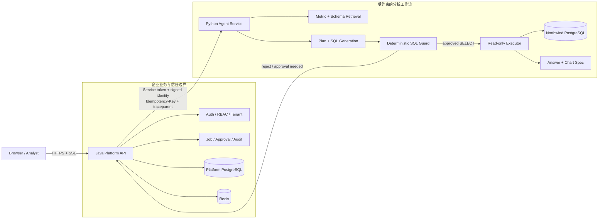
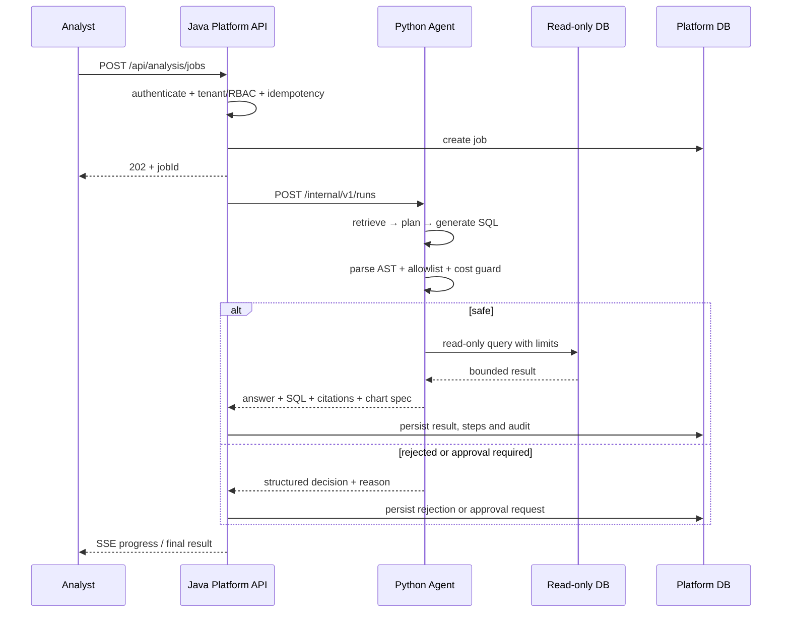

# 总体架构（P0）

## 设计目标

系统必须同时满足三件事：让分析员能自然提问，让查询结果可验证，让模型无法直接取得超出业务规则的数据库权限。为此采用面向业务的平台层与面向 AI 的工作流层分离设计。

## 服务职责

| 能力 | Java Platform API | Python Agent Service |
|---|---|---|
| 用户登录、JWT、会话 | 拥有 | 不实现 |
| 租户和 RBAC | 拥有并签发内部身份声明 | 只消费可信声明并再次校验资源范围 |
| 数据源登记、密钥管理 | 拥有 | 只接收短期引用或服务端解析后的授权配置 |
| 任务、状态机、审批、审计 | 权威数据源 | 报告步骤和中断原因，不越权变更审批结果 |
| 模型调用、RAG、schema 选择 | 不实现 | 拥有 |
| SQL 生成与 AST 检查 | 接收结构化结果 | 拥有，确定性 guard 是执行前最后一道应用防线 |
| 查询执行 | 不直接暴露给浏览器 | 使用专用只读账号、只读事务和资源限制 |
| 对外 API 与 SSE | 唯一入口 | 仅暴露受服务令牌保护的内部 API |

详细取舍见 [ADR-0001](adr/0001-java-python-boundary.md)。

## 数据边界

- **平台 PostgreSQL**：用户、租户、数据源元数据、指标文档、任务、步骤、审批和审计。
- **业务 PostgreSQL**：Northwind 业务数据。使用单独的只读账号，平台迁移账号不能复用。
- **Redis**：短期任务进度、缓存和幂等辅助信息，不作为最终业务状态的唯一来源。
- **模型上下文**：只提供问题、相关指标片段、相关 schema 摘要和有限安全错误；不提供凭据、完整 DSN 或无关业务样例。

## 关键不变量

1. 浏览器永远不能直接调用 Python 服务或业务数据库。
2. Python 不信任浏览器提交的 `tenant_id`、`user_id` 或角色。
3. 所有平台数据访问显式限定 `tenant_id`；工程版再增加 PostgreSQL RLS 作为纵深防御。
4. 只有可成功解析且通过 allowlist 的单条 SELECT/CTE 查询才能进入执行器。
5. SQL guard 的结论不能被模型文本覆盖。
6. 查询在只读事务内执行，并受 statement timeout、行/列/响应字节上限约束。
7. 图表只使用校验后的结构化规范，不执行模型生成的代码。
8. PostgreSQL 保存最终任务状态，Redis 丢失不得导致已完成任务不可追溯。

## 主要请求时序

## P0 风险登记

| 风险 | 后果 | 最早验证方式 |
|---|---|---|
| Northwind 缺少天然同比所需的完整年份 | 演示问题无法稳定复现 | P2 固定数据版本并检查日期覆盖；必要时只调整验收年份，不伪造结果 |
| “为什么下降”容易被写成因果结论 | 产生误导性答案 | 输出模板区分事实、贡献分解和假设；验收检查措辞 |
| Java/Python 状态双写 | 任务状态不一致 | Java 为任务权威源；内部调用携带幂等键；P1 先定义状态机 |
| 过早扩展基础设施 | 核心安全和评测延期 | Kafka、Kubernetes、多方言保持非目标，退出条件按阶段执行 |
| 只靠 Prompt 保证安全 | 危险 SQL 可能执行 | SQL AST、数据库权限、只读事务和资源限制四层防御 |
