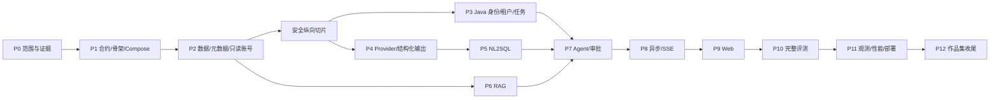

# 实施计划审视与收敛版路线

## 总体判断

原计划的产品目标、Java/Python 边界和安全方向是合理的，足以支撑一个有工程说服力的作品集。主要风险不是功能不足，而是并行目标过多：多租户、审批、RAG、NL2SQL、SSE、可观测性和三端 UI 同时推进，会让安全正确性与评测证据成为最后补做的内容。

建议保留阶段 0～12 的主题，但按“可验证的纵向切片”推进，每一阶段都产生自动化证据。优先证明一条 Northwind 查询从问题到安全结果的闭环，再扩展登录、RAG、审批和大屏。

## 需要先消除的范围歧义

原计划一处把“异步任务和 SSE”列为简历工程版能力，另一处又把它写入阶段 8 的 MVP。为了让工期和验收不漂移，本项目采用两级里程碑：

- **可验证核心 MVP**：单租户演示、固定 Northwind、同步内部调用、轮询任务状态；必须完成 NL2SQL、RAG、确定性安全、只读执行、引用和基础评测。
- **作品集工程版**：多租户强化、异步执行、SSE、人工审批、Redis 恢复、跨服务追踪和性能报告。

外部 API 从 P1 起仍返回任务资源并预留事件契约，使核心 MVP 升级到 SSE 时不需要推翻领域模型。75～100 小时只适合作为核心 MVP 预算；包含原计划全部“简历工程版”能力时，应按 184～230 小时管理。

## 关键调整

1. **把状态机与 API 契约前置到 P1。** Java 是任务权威源，若不先定义状态和幂等语义，P3、P7、P8 会重复返工。
2. **把评测集从 P10 前移。** P2 固定 Northwind 版本时创建首批 10～15 条 gold case；之后每个阶段持续扩充到 50 条。
3. **先完成无模型的安全纵切。** 固定一条 SQL 走完整个 guard、只读执行、结果限制和审计链路，再接入 LLM，能避免把模型问题与基础设施问题混在一起。
4. **RAG 先做全文检索基线。** 先测可复现的 lexical baseline，再加入 pgvector 与 RRF，才能证明混合检索的实际收益。
5. **审批只处理明确策略。** 首版将高成本和受控敏感列作为审批类型；写操作和跨租户查询始终拒绝，管理员也不能放行。
6. **SSE、Redis、OpenTelemetry 后置但预留字段。** P1 契约包含 `trace_id`、事件版本和状态时间戳；P8/P11 再实现传输与观测。
7. **Kubernetes 和消息队列退出主路径。** 它们只在有测量证据时加入，不作为 MVP 完成条件。

## 收敛后的依赖顺序

## 各阶段退出证据

| 阶段 | 核心交付 | 必须留下的证据 |
|---|---|---|
| P0 | PRD、边界 ADR、架构图、验收种子 | 文档评审；能在 60 秒解释服务边界 |
| P1 | 三服务骨架、Compose、OpenAPI、状态机 | 空业务 CI；三个 `/health`；无密钥 `.env.example` |
| P2 | 固定数据、只读角色、schema introspection | 写入失败、跨 schema 失败、元数据快照、首批 gold case |
| 安全纵切 | 固定 SQL 经 guard 到执行与审计 | 真实 PostgreSQL 集成测试；危险 SQL 到达执行器次数为 0 |
| P3 | JWT/RBAC/租户/任务/审计 | 越权与幂等测试、Flyway/Testcontainers |
| P4 | Provider 抽象、结构化输出 | Fake LLM 测试；非法 JSON 和超时分类 |
| P5 | NL2SQL、安全修复、成本检查 | 危险查询回归集与阶段性 execution accuracy |
| P6 | 指标文档、混合检索、引用 | lexical/vector/hybrid 对比报告 |
| P7 | LangGraph、持久化、审批 | 重启恢复、重复审批、循环上限测试 |
| P8 | 异步任务、Redis 进度、SSE | 断线重连、事件顺序、最终状态落库 |
| P9 | 分析 UI、表格、图表、轨迹 | 端到端演示；无任意代码执行 |
| P10 | 完整自动化与评测 | 50+ NL2SQL、20+ RAG、失败分类报告 |
| P11 | trace、指标、性能、Compose 部署 | 实测 P95/错误率/成本和故障验证 |
| P12 | README、截图、视频、简历证据 | 所有数字可追溯到报告或 CI |

## P1 建议切片

P0 评审通过后，下一个实现切片应控制在以下范围：

1. 定义任务状态 `CREATED → PLANNING → VALIDATING → RUNNING → COMPLETED`，以及 `REJECTED / WAITING_APPROVAL / FAILED / CANCELLED` 终态或分支。
2. 创建 Java、Python、Web 三个最小服务，各提供健康检查。
3. 编写 Java 对外 API 与 Python 内部 API 的最小 OpenAPI 契约。
4. Compose 仅启动平台 PostgreSQL、Northwind PostgreSQL 和 Redis，并建立只读业务账号。
5. CI 运行 Java 测试、Python 测试和 Web lint/build。
6. 不在 P1 接入真实模型、不写 Prompt、不做漂亮 UI。
